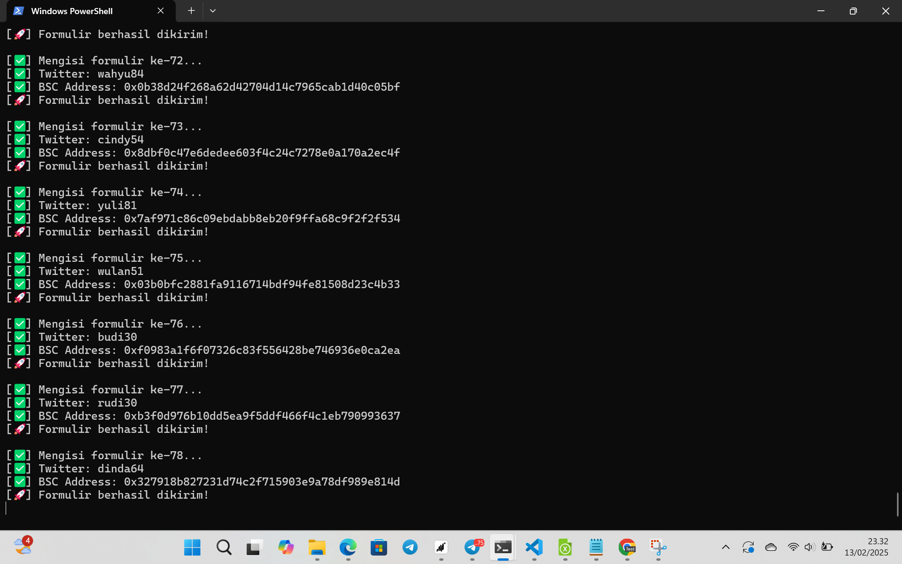
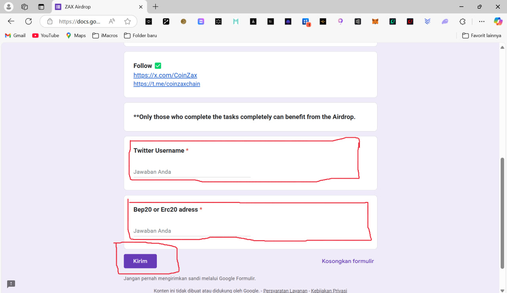

## Installation

1. Clone the repository:
```bash
git clone https://github.com/bangzx/form-auto-bot.git
cd form-auto-bot
```
2. Edit your file wallets.txt if use termux type copy here: **nano wallets.txt** and **ctrl** **x** and **y** enter to save
```bash
nano wallets.txt
```
3. Install module 
```bash
npm install
```
4. Run the bot
```bash
node bot.js
```



